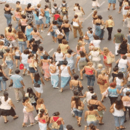
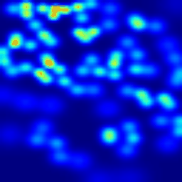
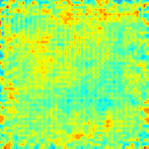

# CSRNet-tf
Unofficial Implementation of CSRNet: Dilated Convolutional Neural Networks for Understanding the Highly Congested Scenes.

## What is CSRNet?
**CSRNet** is a novel Deep Learning model proposed by **Yuhong Li et al.** whose goal is to analyse **crowd pattern** in densely crowded images. It is **fully convolutional model** with a FrontEnd and a BackEnd.

##  Implementation Details
We have implemented all 4 architectures of proposed as a part of the CSRNet paper. The handy and efficient **Keras API** of **TensorFlow** has been used in this implementation.

The Keras API of TensorFlow offers several high level operations for ease of coding while retaining the performance of other APIs of TensorFlow.

The input pipeline we use is an efficient **Data API** pipeline for parsing tfRecord files. (We create a tfRecord file for all the input data)

The input data consisted of the input image and the smoothed crowd label created from the discrete labels from corresponding datasets (ShangaiTech) as described in the paper.
 
## Details About the model
As proposed by the paper, we use the first 13 layers of **VGGNet** pre-trained ImageNet as our FrontEnd Network. We build 4 BackEnds with different combinations of **Convolutions** and **Dilated Convolutions** namely **A,B,C,D**.

The loss function we used was a **simple L2 loss** due to the usage of a smoothed label as target.

## Training Procedure
We used the **Adam Optimizer** for training purposes. The first 13 layers of a pre-trained VGGNet were frozen, thus effectively training only the BackEnd Nets.

We used the **ShangaiTech** Dataset for training.

We trained the model for 1,70,000 iterations about 36 hrs in an system with a **NVIDIA 1080Ti** (11GB RAM) graphics card and an **Intel i5 processor** with 16GB RAM.

## Results
The results we obtained, considering the small amount of data we used, is great. Our model was able to effectively capture the crowd patterns in most images. We demonsrate the results in the form of GIFs below.

**Test Images**

**Ground Truth Labels**

**Our Predictions**

Further improvements are always possible with respect to training.